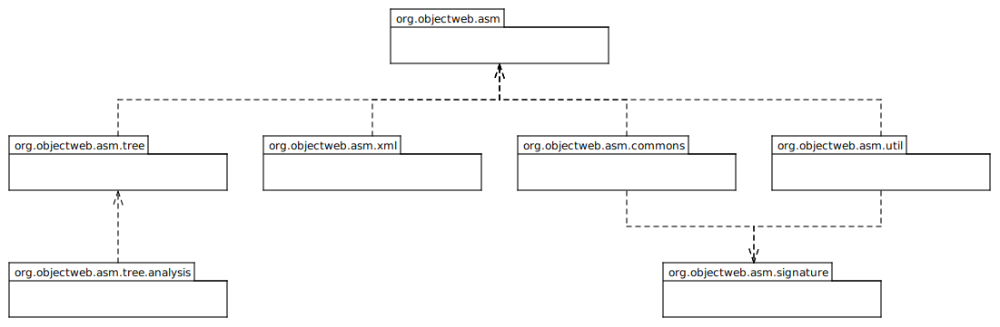
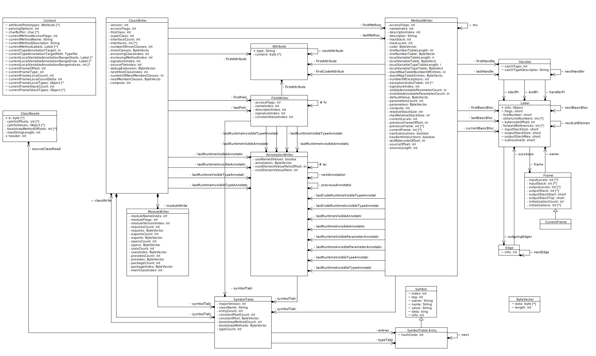
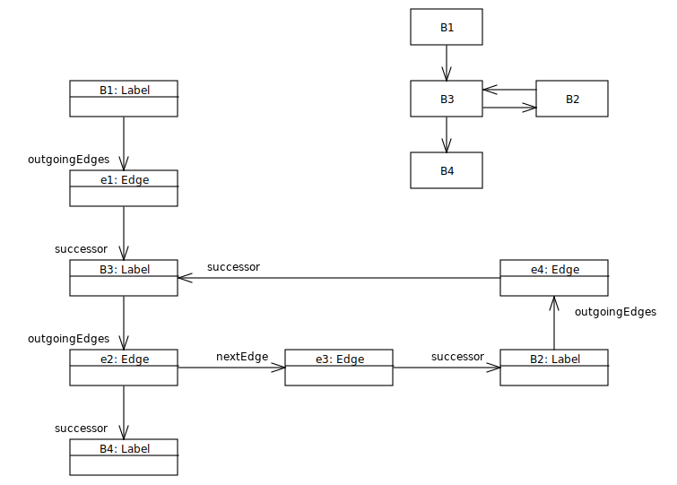

## ASM 6 开发者指南

> 本篇文章是针对 ASM 官方提供的开发者指南进行译文。原文链接 : [ASM 6 Developer Guide](https://asm.ow2.io/developer-guide.html)

### 1. 前言

本指南主要面向希望对 `ASM` 仓库进行共享的开发者，但是对其它开发者同样有用。本篇文章主要介绍了 `ASM` 的代码组织结构、主要的数据结构和使用的算法介绍。同时本文也通过一个例子介绍了如何优化 `ASM` 的性能和代码量。

### 2. 安装 ASM

在参与 `ASM` 项目之前，开发者需要知道如何编译 `ASM` 源码，以及如何测试并发布一个版本，下文将针对以上三点进行介绍。在开始之前，需要下载 `ASM` 源码仓库，可以通过 `git clone` 下载  https://gitlab.ow2.org/asm/asm.git 完成，或通过下载 `git` 仓库的快照 https://gitlab.ow2.org/asm/asm 下载。

#### 2.1 概述

在 `ASM` 仓库中，`ASM` 源码被分为多个目录，每个目录分别对应一个 `artifact`，比如 `asm.jar`、 `asm-util.jar` 等。

- `asm`、`asm analysis`、`asm commons`、`asm tree`、`asm util` 和 `asm xml` 目录中包含了相应工件及其单元测试的源代码。它们使用标准的 `Maven` 目录布局，这也是 `Gradle` 使用的默认布局；
- `asm-test` 目录包含了以前项目中用于实现单元测试的基类，以及在这些项目中用作测试的预编译 `Java` 类；
- `benchmarks` 目录中定义了一些 `JMH` 基准来测量 `ASM` 的性能，并将其与以前的版本（以确保没有性能倒退）和其他字节码操作库进行比较；
- `gradle` 目录中包含 `Gradle wrapper` 以及调用它的 `Linux` 和 `Windows` 脚本
- `tools` 目录中包含两个用于构建 `ASM` 的 `Gradle` 项目，一个工具用于将 `JAVA6` 编译类修改为 `JAVA5` 级别，另一个用于给每个 `ASM artifact` 生成 `module-info.class` 文件，两个工具都使用 `ASM` 本身开发。

`build.gradle` 文件定义了用于生成、测试和打包的 `ASM` 目标，这些目标将在以下章节中进行介绍。

#### 2.2 编译

构建所有项目时在 `ASM` 源码的根目录中使用 `gradle/gradlew build` 指令，如果是构建单个项目，例如 `asm-tree`，使用 `gradle/gradlew :asm-tree:build` 指令进行构建。 `build` 指令将编译源码、运行单元测试并执行其他检查，以确保代码的正确，它与以前的 `ASM` 版本具有向后兼性容，并且单元测试完全覆盖了旧版本。

> 注意：如果编译过程中源代码格式校验失败，可以通过 `gradle/gradlew googleJavaFormat` 进行重新格式化来修复。

#### 2.3 运行单元测试

测试所有项目时在 `ASM` 源码的根目录使用 `gradle/gradlew test` 指令，测试单个项目时，例如  `asm-tree`，使用 `gradle/gradlew :asm-tree:test` 进行测试。

可以使用 `gradle/gradlew jacotestreport` 生成测试覆盖率报告，报告结果可以在每个项目的 `build/reports/jacoco` 目录中找到。

#### 2.4 发布

可以使用 `gradle/gradlew uploadArchives` 指令进行发布，该指令会生成对应的二进制文件，包含编译后的 `javadoc.jar` 、 `source.jar`、`POM` 文件和对应的数字签名。

### 3. Code Review

本节介绍了 `ASM` 源代码的组织结构、主要的数据结构和最复杂的算法，这是在安装和构建程序之后需要了解的下一个重要事项，以便对本项目做出贡献。

#### 3.1 代码组织

`ASM` 由以下几个包结构构成。



- `org.objectweb.asm` 是核心包，包中定义了 `ASM` 中的 `Visitor API`以及提供了用于读写 `class` 文件的 `ClassReader` 和 `ClassWriter` 对象。该包不依赖其它任何包，并且可以单独存在；
- `org.objectweb.asm.signature` 包中提供了泛型定义的相关操作 `API`，它独立于核心包之外，作为对核心包的补充；
- `org.objectweb.asm.tree` 包在核心包提供的类似 `SAX API` 之上提供一个类似 `DOM API` 的操作形成，也称之为`树 API`。它可以用于实现复杂的类转换，对于这些转换，核心包将过于复杂而无法使用；
- `org.objectweb.asm.tree.analysis` 包是基于 `tree` 包提供的用于静态字节码分析的模块，同时也可用于需要知道每个指令的 `stack map frames` 信息的转换；
- `org.objectweb.asm.commons` 包提供了一些基于 `core` 和 `tree` 包的类适配器，这些适配器可以直接使用，也可以通过继承进行扩展使用；
- `org.objectweb.asm.util` 包中提供了一些有用的类访问者和适配器，用于调试时使用，在运行时通常不需要它；
- `org.objectweb.asm.xml` 已弃用，它提供了在 `XML` 之间转换类的能力。

从实现的角度来看，核心包是最复杂的包。`tree`、`util` 和 `xml` 包非常简单（它们只是将类从一个高级表示转换为另一个高级表示，这比将类从字节数组形式转换为高级表示（反之亦然）要简单得多。`signature` 包也非常简单。事实上，除了核心包之外，只有 `commons` 和 `analysis` 包是不完全琐碎的包。但 `analysis` 包中使用的算法与第 3.5 节中解释的算法类似。这就解释了为什么本指南的其余部分只关注核心包。

#### 3.2 主要数据结构

##### 3.2.1 对象模型

核心包总共包含类和接口共 `28` 个，除了 `Opcodes` 接口、 `5` 个抽象 `visitor` 类（`AnnotationVisitor`、 `ClassVisitor`、 `FieldVisitor`、 `MethodVisitor` 和 `ModuleVisitor`）和 `6` 个工具类（`ConstantDynamic`、 `Constants`、 `Handle`、 `Type`、 `TypePath` 和 `TypeReference`）之外，还剩下 `16` 个类。如下所示：



已编译的类文件，即 `.class` 文件通过 `ClassReader` 转换为 `ASM` 的 `Event` 事件访问。生成 `.class` 二进制文件由其他围绕 `ClassWriter`的  `14` 个类完成：

- 类（`Classes`）：
  - `ClassWriter` 是主要的入口点，它包含了描述类的版本、访问标志、名称等的字段。它还包含对表示常量池、字段、方法、注释和类属性的其他对象的引用。
- 常量池（`Constant pool`）:
  - `SymbolTable` 类用于表示常量池和引导方法，以及用于计算堆栈映射帧(`stack map frames`)的 `ASM` 特定类型表。这些结构以字节数组形式和符号实例的散列集表示，以便有效地测试给定的常量池项、引导方法或类型是否已添加到符号表中。该类从 `ClassWriter`、`AnnotationWriter`、`FieldWriter`、`MethodWriter` 和 `ModuleWriter` 类引用，因为类、注释、字段、方法和模块需要将它们引用的常量添加到常量池和或引导方法；
  - `Symbol` 类用于表示单个常量池项、单个引导方法或单个用于计算堆栈映射帧(`stack map frames`)的 `ASM` 特定类型。
- 字段（`Fields`）：
  - `FieldWriter` 类用于生成字段(`Field`)，它包含描述字段名称、类型、签名、值等的字段，还包含对表示字段注释和属性的其他对象的引用。
- 方法（`Methods`）：
  - `MethodWriter` 类用于生成方法(`Method`)，它包含描述方法名称、签名、异常等信息，还包含对表示方法注释和属性的其他对象的引用。方法的代码存储在字节码指令访问期间构造的字节数组中，`Label` 标记用于指向 `Label` 指令集合对应的指令；
  - `Label` 类用于引用指令，但也用于表示基本块，这些块用于自动计算方法的最大堆栈大小和堆栈映射帧表；
  - `Handler` 类用于表示 `try-catch` 块，每个 `Handler` 持有三个 `Label` 对象，它们定义 `try` 块的开始和结束，以及 `catch` 块的开始；
  - `Frame` 和 `CurrentFrame` 类用于自动计算方法的堆栈映射帧；
  - `Edge` 类用于表示方法的控制流图，它是基本块的图，即标签对象的图。`Edge`  是两个 `Lebel` 的连接对象。
- 模块（`Modules`）：
  - `ModuleWriter` 类用于生成 `Module`、`ModulePackages`和 `ModuleMainClass` 类相关的属性（`Java` 模块定义被编译成包含这些属性的类文件）。
- 注解（`Annotations`）：
  - `AnnotationWriter` 类用于生成注解，这个类是被 `ClassWriter`、`FieldWriter` 和 `MethodWriter` 类引用，因为类、字段和方法可以有注解。
- 属性（`Attributes`）：
  - `Attribute` 类用于读写非标准类属性。它必须为每个必须读写的特定非标准属性子类化。这个类是被 `ClassWriter`、`FieldWriter` 和 `MethodWriter` 类引用的，因为类、字段和方法可以有属性。
- 资源（`Resources`）：
  - `ByteVector` 类用于在类元素被访问时序列化它们，它用于表示常量池、注释值、方法代码、堆栈映射表、行号表等。

##### 3.2.2 集合

核心包没有使用任何 `java.util` 包下的类。相反，列表、集合和图的数据结构被内部封装。

- 列表的实现通过链表的方式进行实现，其链接直接存储到列表元素本身中。例如，`FieldWriter` 对象的列表表示为 `FieldWriter` 对象本身，通过它们内部的 `fv` 字段链接。对于 `MethodWriter`、`AnnotationWriter`、`Label` 等也是如此。与使用单独的对象来存储节点相比，此方法的优点是（如 `java.util.LinkedList`)能节省内存，缺点是一个给定的元素不能同时属于多个列表，但这在ASM中不是问题；

- 在核心包中只有 `SymbolTable` 类使用到哈希的数据结构，它的内部通过使用 `SymbolTable.Entry` 数组的形式来链接下一个节点，换句话来说，这种哈希结构同样是嵌入到自身的字段中，优点同样是节省内存，缺点是不能同一个给定元素不能同时属于多个集合；

- 同样，控制流图（见第3.5节）数据结构嵌入到图形节点本身，即标签对象中。

  

  由于 `Label` 对象必须同时存在多个数据结构中，因此它们有几个不同的字段来表示这些数据结构。

  - `nextBasicBlock` 字段按照方法的访问顺序对方法的标签列表进行编码；
  - `outgoingEdges` 字段用于存储表示控制流图的 `Edge` 对象；
  - `nextListElement` 用于存储用于计算方法的最大堆栈大小和堆栈映射帧的算法中的 `Label` 列表（见[第 3.5.1 节](#3.5.1)）。

#### 3.3 主要算法

##### 3.3.1 ClassReader

`ClassReader` 的算法实现很简单，概述如下：

- 解析常量池和引导方法（在构造函数中）：
  - 将每个常量池的起始偏移量存储在 `cpInfoOffsets` 中
  - 将每个方法的起始偏移量存储在 `bootstrapMethodOffsets` 中
  - 将最长的字符串常量存储在 `maxStringLength` 中
- 解析类（在 `accept` 和 `read*` 方法中）：
  - 解析 `header` 头部
  - 解析类的 `attribute` 属性，根据属性的复杂度可划分为：
    - 对于简单的属性解析并存储到局部变量中，或者将属性的起始偏移量存储到局部变量中
  - 调用检测到的属性所对应的方法，对于上一步没有解析的复杂属性（如注解），解析它们的同时访问它们：即解析一个部分，访问它，解析下一个部分，访问它，等等。
  - 对于每个字段（在 `readField` 方法中）：
    - 解析 `header` 头
    - 解析字段的 `attribute` 属性
      - 解析它并将其值存储在局部变量中，或者在局部变量中存储它的起始偏移量
    - 调用 `visitField` 方法
    - 调用检测到的属性所对应的方法，对于上一步没有解析的复杂属性（如注解），解析它们的同时访问它们：即解析一个部分，访问它，解析下一个部分，访问它，等等
    - 最后调用 `visitEnd` 方法
  - 对于每个方法（在 `readMethod` 方法中）：
    - 解析 `header` 头
    - 解析方法的 `attribute` 属性
      - 解析它并将其值存储在局部变量中，或者在局部变量中存储它的起始偏移量
    - 调用 `visitMethod` 方法
    - 如果返回的访问者是 `MethodWriter`，并且其 `ClassWriter` 的常量池是从该 `reader` 中复制的（参见[第 3.3.2 节](#3.3.2)），则可以按原样复制方法字节：然后跳过后面所有步骤
    - 调用检测到的属性所对应的方法，对于上一步没有解析的复杂属性（如注解），解析它们的同时访问它们：即解析一个部分，访问它，解析下一个部分，访问它，等等
    - 对于特殊的 `Code Attribute`（在 `readCode` 方法中）：
      - 找到标签并将其存储在 `Context.currentMethodLabels` 数组中：
        - 查找代码中的 `Label` 标签
        - 查找 `Exception` 中的 `Label` 标签
        - 查找 `LineNumber` 和局部变量表中的 `Label` 标签
        - 查找其它 `Code Attribute` 中的 `Label` 标签
      - 如果有堆栈映射表，则解析第一帧
      - 解析指令：
        - 如果此偏移量是堆栈映射帧，则解析指令，调用 `visitFrame`，然后解析下一帧
        - 如果此偏移量是 `Label` 标签，则调用 `visitLable`
        - 如果此偏移量是 `line number entry`，则调用 `visitLineNumber`
        - 调用 `visitXXXInsn` 方法
      - 为在第二步中解析的每个非标准 `Code Attribute`  调用 `visitAttribute`
      - 调用 `visitMaxs`
      - 调用 `visitEnd`
    - 调用 `visitEnd`
  - 调用 `visitEnd`

有几点值得注意：

- 行号和堆栈映射帧的访问与指令的访问交织在一起。在处理堆栈映射帧的指令时，不仅仅是访问，同时还进行堆栈映射表和方法代码的解析。与先解析堆栈映射表后解析方法代码相比，其优点是不需要复杂的数据结构来存储第二步解析的帧；
- 除了 `Utf8` 和 `ConstantDynamic` 常量，其它常量池中的值在每次引用的时候都会被解析，它们的值存储在 `cpInfoValues` 中，这里需要使用一个足够大的 `char` 数组进行存储，所以需要提前计算最大长度。

##### 3.3.2 ClassWriter, AnnotationWriter, FieldWriter, MethodWriter and ModuleWriter

由于类成员的访问可以交错进行（可以先访问一个字段，然后开始访问方法，又开始返回到访问该字段的注解，继续执行该方法的一些说明，访问字段的属性，向方法添加新的指令，等等），所以不可能按从头到尾的顺序构造类文件的字节数组。相反，有必要使用几个可以同时增长的字节向量。这就是为什么有几个 `writer` 类，这与 `reader` 的情况不同。

`ClassWriter` 类是主要的入口点。它包含类头元素及其字段和方法的列表，以及一个 `SymbolTable` 对象， `SymbolTable` 对象包含该类的常量池项和引导方法，它是很多 `Symbol` 对象的的哈希值集合，以避免在常量池或引导方法数组中多次添加同一项。 `SymbolTable`  可以通过向现有类的构造函数传递 `ClassReader` 参数来创建。这允许将未更改的方法按原样从类读取器复制到类编写器，而无需访问它们的内容（参见[第 3.3.1 节](#3.3.1)）。

`AnnotationWriter`、`FieldWriter` 和 `ModuleWriter` 类非常简单：它们通过使用 `ClassWriter` 的 `SymbolTable` 将访问事件转换为字节数组表示，以便在必要时添加常量池项。最复杂的 `writer` 类是 `MethodWriter` 类，因为它管理高级功能，如方法的最大堆栈大小和局部变量数量的自动计算，堆栈映射帧的自动计算，以及短跳转和跳转指令的自动管理，如果没有这些特性，每个 `visitXxxInsn` 方法将非常简单，也就是说，它只会将指令的字节码表示添加到代码字节向量中。

相反，为了能够自动计算最大堆栈大小、最大局部变量数量和堆栈映射帧，每个 `visitXxxInsn` 方法执行以下操作：

- 将指令追加到代码字节向量
- `if (currentBasicBlock != null)` // if some automatic computation is needed
  - `if (compute == COMPUTE_ALL_FRAMES || compute == COMPUTE_INSERTED_FRAMES)`
    - 在堆栈帧上模拟此指令的执行
  - `else // compute == COMPUTE_MAX_STACK_AND_LOCAL`
    - 在堆栈高度上模拟此指令的执行
  - 跟踪使用的局部变量
  - 跟踪此指令的后续者
  - 更新 `currentBasicBlock`

通过使用 `visitXxxInsn` 方法中构造的控制流图（有关详细信息，请参阅[第 3.5 节](#3.5)），最大堆栈大小或堆栈映射帧实际上是在 `computeMaxStackAndLocal` 和 `computeAllFrames` 方法中计算的。

##### 3.3.3 Label

从用户的角度来看，`Label` 类用于引用指令。内部用于存储指令的字节码偏移量（即指令第一个字节的字节码数组索引），并计算相对字节码偏移量（即两条指令字节码偏移量之间的差值）。它还用于表示基本块，用于自动计算方法的最大堆栈大小和堆栈映射帧（见[第3.5 节](#3.5)）。

跳转指令（如 `IFEQ` 或 `GOTO`）以操作码的形式存储在字节码中，后面跟着目标指令的相对字节码偏移量（此相对偏移量是目标指令的字节码偏移量与跳转指令的字节码偏移量之间的差值）。在后向跳转（即跳转到字节码中跳转指令之前的指令）的情况下，可以很容易地计算出这个相对偏移量，但在前向跳转（即跳转到跳转指令之后的指令）的情况下，根本无法计算相对偏移量，因为在这种情况下，目标指令尚未访问，因此其字节码偏移量未知。前跳的情况按以下方式解决：

- 跳转指令的（临时）相对偏移量等于 `0`；
- 目标 `Label` 对象被更新以记住这个跳转指令对这个标签的前向引用（`Label` 中的 `forwardReferences` 数组用于此）；
- 当访问此 ` Label`时，即当其字节码偏移量已知时，将更新该标签的所有前向跳转指令（由 `forwardReferences` 给出），以将临时相对偏移量替换为其实际值，现在可以计算这些值。

##### 3.3.4 toByteArray

`ClassWriter` 中的 `toByteArray` 方法将 `writer` 类中构造的所有部分组合在一起，以获得类的完整字节表示。这分为两个步骤：

- 类的大小是通过将所有片段的大小相加来计算的，该大小由getSize方法给出（此方法可以向常量池添加项，从而修改其大小；这就是为什么常量池大小只在最后添加的原因）；
- 通过调用每个工件上的 `putXxx` 方法来完成字节向量的大小分配，以及片段按正确的顺序复制到这个向量中（例如每个 `FieldWriter` 上的 `putFieldInfo`）。

#### 3.4 Jump 跳转指令算法

`IFEQ` 和 `GOTO` 这样的跳转指令用两个字节码的有符号值存储相对字节码偏移量。因此，该偏移量可以在 `-32768` 和 `32767` 之间变化。然而，一个方法的字节码可以大到 `65535` 个字节，因此，可能存在无法用有符号的两个字节值表示的相对字节码偏移量。希望有两个特殊的跳转指令将它们的相对字节码偏移量存储在有符号的四字节值中，即 `GOTO_W` 和 `JSR_W`。

在后向跳转的情况下，当跳转指令被访问时，跳转偏移量是已知的。根据这个相对偏移量的值，可以很容易地知道使用 `GOTO` 或 `GOTO-W`。但在前向跳转的情况下，这是不可能的，因为指令还未范文。第一个解决方案是假设这个偏移量需要 `4` 个字节，并且始终使用`GOTO-W` 进行前向跳转，但这并不是很理想。第二个解决方案是假设这个偏移量需要 `2` 个字节，并使用一个普通的跳转指令，当偏移量已知时，保留 `2` 个字节来存储偏移量。问题是，如果偏移量最终需要 `4` 个字节，则必须用另一个使用 `4` 字节偏移量的指令替换跳转指令，这可能会使其他跳转指令中已计算的偏移量失效。在 `ASM` 中，选择了第二种解决方案，它需要一种方法来替换原来需要长偏移量的前向跳转指令。本节的其余部分将介绍用于此的算法。

##### 3.4.1 基本算法实现

该算法使用以下特性：

- 方法的最大大小，因此前向跳转偏移量是 `65535`，它可以存储在一个无符号的两字节值中；
- `JVM` 字节码指令集的操作码不可能使用所有 `255` 个操作码，所以有足够多的未使用的操作码来定义每个标准跳转指令操作码的无符号等价物（我们注意到 `ASM_GOTO`、`ASM_JSR`、`ASM_IFEQ` 等等）。

基于这些特性，如果在 `visitLabel` 中，前向偏移量大于 `32737`，则相应指令的操作码将更改为具有无符号偏移量的等效非标准操作码，并将该偏移量存储为无符号 `short`。

然后，当访问了所有类并将其转换为字节数组时，如果使用了一些非标准操作码，则必须用标准操作码替换它们。为此：

- 清除 `ClassWriter` 的内容（除了它的符号表 `SymbolTable`），并使用类读取器解析该 `ClassWriter` 字节数组，以重建类。该类使用特殊的 `EXPAND_ASM_INSNS` 类读取器标志进行解析，其效果将在下面解释；
- 类读取器将特的 `ASM` 指令转换为标准指令，并显式地使用 `GOTO_W` 和 `JSR_W` 指令，由于 `EXPAND_ASM_INSNS` 标志的存在，使现有的`GOTO_W` 和 `JSR_W` 指令保持不变（通常它们被转换为 `GOTO` 和 `JSR`，但这里不需要，因为我们知道将需要 `4` 个字节的偏移量，这也是避免无限循环的必要条件，因为类编写器被清除并无限期地重建）。

此过程将删除特定于 `ASM` 的指令，但可能也会引入新的 `ASM` 指令。实际上，由于特定 `ASM` 的指令被更长的标准指令序列所取代，因此现有指令之间的某些相对偏移量（刚刚低于 `32737` 的限制）可能会大于此限制。在这种情况下，该过程将重复执行：包含新的 `ASM` 特定指令的字节数组将用新的 `ClassReader`（在清除 `ClassWriter` 内容之后）再次进行解析。最终这个过程将收敛，结果将是一个只有标准指令操作码的类。

##### 3.4.2 stack map frames 的影响

前向偏移量大于 `32767` 的 `IFXxx` 指令必须替换为 `IFNotX GOTO_W` 序列，该序列要求在 `GOTO_W` 之后有一个堆栈映射帧（对于 `Java 7` 以上的版本）。此堆栈映射帧可能尚未存在，在这种情况下，需要计算并插入它。为此，一种解决方案是重新计算所有堆栈映射帧，但这中方式不太可能（计算堆栈映射帧可能需要访问类层次结构，可能会加载类等），而且效率不高。相反，我们使用现有的堆栈映射帧来计算需要插入的堆栈映射帧会更好。事实上，根据定义，现有的堆栈映射帧足以计算局部变量和每个指令处堆栈的状态，使用线性算法从头到尾解析指令和帧。

具体实施如下：

- 当清除 `ClassWriter` 以替换特定于 `ASM` 的指令时，它将被置于`COMPUTE_INSERTED_FRAMES`模式；
- 在这种模式下，`MethodWriter` 使用 `CurrentFrame` 而不是 `Frame` 来模拟每个指令的执行，其效果是显式地计算每个指令的局部变量和堆栈的状态（通常，在 `COMPUTE_FRAMES` 模式下，此显式状态仅在基本块级别计算，不在指令级）。现有帧也按原样使用，用访问的帧替换当前帧。最后，如果访问了具有特殊类型F_INSERT的帧，则使用当前帧状态在当前字节码偏移量处插入帧；
- 在用于替换 `ASM` 特定指令的类读取器中，当 `IFXxx` 指令被 `IFNotX GOTO_W` 序列替换时，将发出一个 `visitFrame`（`F_INSERT`，…），其中包含一个空内容，以便在此位置插入一个帧。

##### 3.4.3 示例

如下面的代码所示：

```java
public void m(int i, int j) {
    for (; cond(i); --i) {
        if (j == 0) {
            break;
        }
        ...
    }
}
```

将被编译成以下字节码指令：

```java
public m(II)V
  GOTO L1
 L2
  ILOAD 2
  IFNE L3
  GOTO L4
 L3
  ...
  IINC 1 -1
 L1
  ALOAD 0
  ILOAD 1
  INVOKEVIRTUAL C.cond(I)Z
  IFNE L2
 L4
  RETURN
```

在每个指令访问期间，偏移量按如下步骤计算：

| Offset | Instruction      | Comment                                                      |
| :----- | :--------------- | :----------------------------------------------------------- |
| 0      | ` GOTO L1`       | relative offset unknown when this instruction is visited     |
| 3      | `L2`             |                                                              |
| 3      | ` ILOAD 2`       |                                                              |
| 4      | ` IFNE L3`       | relative offset unknown when this instruction is visited     |
| 7      | ` GOTO L4`       | relative offset unknown when this instruction is visited     |
| 10     | `L3`             | relative offset for `IFNE L3` becomes known: 10 - 4 = 6      |
| 10     | ` `...           |                                                              |
| 32764  | ` IINC 1 -1`     |                                                              |
| 32767  | `L1`             | relative offset for `GOTO L1` becomes known: 32767 - 0 = 32767 |
| 32767  | ` ALOAD 0`       |                                                              |
| 32768  | ` ILOAD 1`       |                                                              |
| 32769  | ` INVOKEVIRTUAL` |                                                              |
| 32772  | ` IFNE L2`       | relative offset = 3 - 32772 = -32769                         |
|        | `L4`             |                                                              |
|        | ` RETURN`        |                                                              |

在计算偏移量的过程中，`IFNE L2` 的偏移量是 `-32769`，已经超出 `short` 类型保存的范围，所以这个指令被转换成 `IFEQ` `GOTO_W`。

| Offset | Instruction      | Comment                                                     |
| ----- | ---------------- | ------------------------------------------------------------ |
| 0     | ` GOTO L1`       | relative offset = 32767, changed during visit of `L1`        |
| 3     | `L2`             |                                                              |
| 3     | ` ILOAD 2`       |                                                              |
| 4     | ` IFNE L3`       | relative offset = 6, changed during visit of `L3`            |
| 7     | ` GOTO L4`       | relative offset still unknown                                |
| 10    | `L3`             |                                                              |
| 10    | ` `...           |                                                              |
| 32764 | ` IINC 1 -1`     |                                                              |
| 32767 | `L1`             |                                                              |
| 32767 | ` ALOAD 0`       |                                                              |
| 32768 | ` ILOAD 1`       |                                                              |
| 32769 | ` INVOKEVIRTUAL` |                                                              |
| 32772 | ` IFEQ L4`       | relative offset = 8                                          |
| 32775 | ` GOTO_W L2`     | relative offset = 3 - 32775 = -32772                         |
| 32780 | `L4`             | relative offset for `GOTO L4` becomes known: 32780 - 7 = 32773 |
|       | ` RETURN`        |                                                              |

当访问到 `L4` 指令时，对应的 `GOTO L4` 对应的偏移量是 `32773`，也超出了 `short` 的存储范围。如同[3.4.1](#3.4.1) 小节所讲，`GOTO` 指令将被替换为使用 `unsigned short` 存储的非标准 `ASM_GOTO` 指令。

| Offset | Instruction      | Comment                                                     |
| ----- | ---------------- | ------------------------------------------------------------ |
| 0     | ` GOTO L1`       | relative offset = 32767, changed during visit of `L1` |
| 3     | `L2`             |                                                       |
| 3     | ` ILOAD 2`       |                                                       |
| 4     | ` IFNE L3`       | relative offset = 6, changed during visit of `L3`     |
| 7     | ` ASM_GOTO L4`   | relative offset = 32773, changed during visit of `L4` |
| 10    | `L3`             |                                                       |
| 10    | ` `...           |                                                       |
| 32764 | ` IINC 1 -1`     |                                                       |
| 32767 | `L1`             |                                                       |
| 32767 | ` ALOAD 0`       |                                                       |
| 32768 | ` ILOAD 1`       |                                                       |
| 32769 | ` INVOKEVIRTUAL` |                                                       |
| 32772 | ` IFEQ L4`       | relative offset = 8                                   |
| 32775 | ` GOTO_W L2`     | relative offset = 3 - 32775 = -32772                  |
| 32780 | `L4`             |                                                       |
| 32780 | ` RETURN`        |                                                       |

由于字节码至少包含一条非标准指令，因此在计算完类的字节数组（在 `tobyterarray` 中）之后，`ClassWriter` 内容将被清除，并通过使用链接到该 `ClassWriter` 的 `ClassReader` 来重新构造。在这个过程中，`ClassReader` 将 `ASM_GOTO` 转换为 `GOTO_W`（并保留现有的 `GOTO_W` ）。当访问到 `L1` 时，我们得到：

| Offset | Instruction      | Comment                                                     |
| ----- | ---------------- | ------------------------------------------------------------ |
| 0     | ` GOTO L1`       | relative offset unknown                           |
| 3     | `L2`             |                                                   |
| 3     | ` ILOAD 2`       |                                                   |
| 4     | ` IFNE L3`       | relative offset = 8, changed during visit of `L3` |
| 7     | ` GOTO_W L4`     | relative offset unknown                           |
| 12    | `L3`             |                                                   |
| 12    | ` `...           |                                                   |
| 32766 | ` IINC 1 -1`     |                                                   |
| 32769 | `L1`             |                                                   |
|       | ` ALOAD 0`       |                                                   |
|       | ` ILOAD 1`       |                                                   |
|       | ` INVOKEVIRTUAL` |                                                   |
|       | ` IFEQ L4`       | relative offset = 8                               |
|       | ` GOTO_W L2`     |                                                   |
|       | `L4`             |                                                   |
|       | ` RETURN`        |                                                   |

此时，`GOTO L1` 的相对偏移变得已知，即 `32769`。这对于 `short` 类型来说偏移量太大，因此 `GOTO L1` 被 `ASM_GOTO L1` 替换为无符号短偏移量，然后继续进行类解析和重构，最终为该类生成一个新的字节数组。因为它仍然包含一个非标准的操作码，所以会重复相同的过程：通过使用 `ClassReader` 解析字节数组来清除和重建 `ClassWriter` 内容。由于特殊的 `EXPAND_ASM_INSNS` 标志，`GOTO_W` 和 `JSR_W` 永远不会转换回 `GOTO` 或 `JSR`，这确保了这个迭代过程最终会收敛。在我们的示例中，第二次迭代不会生成任何新的非标准操作码，我们得到最终结果：

| Offset | Instruction      | Comment                 |
| ----- | ---------------- | -------------------------|
| 0     | ` GOTO_W L1`     | relative offset = 32771  |
| 5     | `L2`             |                          |
| 5     | ` ILOAD 2`       |                          |
| 6     | ` IFNE L3`       | relative offset = 8      |
| 9     | ` GOTO_W L4`     | relative offset = 32775  |
| 14    | `L3`             |                          |
| 14    | ` `...           |                          |
| 32768 | ` IINC 1 -1`     |                          |
| 32771 | `L1`             |                          |
| 32771 | ` ALOAD 0`       |                          |
| 32772 | ` ILOAD 1`       |                          |
| 32773 | ` INVOKEVIRTUAL` |                          |
| 32776 | ` IFEQ L4`       | reative offset = 8       |
| 32779 | ` GOTO_W L2`     | relative offset = -32774 |
| 32784 | `L4`             |                          |
| 32784 | ` RETURN`        |                          |

#### 3.5 控制和数据流分析算法

本节介绍用于计算方法的最大堆栈大小和堆栈映射帧的算法。该算法是一种基于控制和数据流分析的算法，将该方法分解为基本块的控制流图。基本块是一系列指令，其中只有第一条指令是跳转指令的目标，只有最后一条指令才能跳转到其他基本块。方法的控制流图是以基本块为节点，以跳转指令连接的基本块为边的图。此图是在访问每个指令期间构造的。例如，[第 3.5.1 节](#3.5.1)中定义的方法的控制流图如第2节所示。

接下来，我们将介绍用于计算堆栈映射帧的算法，该算法在 `computeAllFrames` 方法中实现。与在 `computeMaxStackAndLocal` 方法中实现的计算最大堆栈大小的算法类似，但更简单（因为只需要堆栈的大小），因此这里不详细说明（除了处理子例程）。

##### 3.5.1基础数据流分析算法

堆栈映射帧(`Stack map frames`)的计算分为两个步骤：

- 在访问每个指令的过程中，通过模拟指令对这个所谓的“输出帧”的前一个状态的动作来更新当前基本块末尾的帧的状态；
- 在 `computeAllFrames` 方法中，使用定点算法计算每个基本块的“输入帧”，例如：基本块开头的堆栈映射帧开始、从第一个基本块的输入帧开始，并使用先前计算的输出帧来计算其他块的输入状态。

让我们举一个简单的例子来解释这个算法的细节。考虑以下非常简单的方法（其中 `B` 是 `A` 的子类）：

```java
public static m(Z)LA;
  GETSTATIC B.VALUE : LB;
  ASTORE 1
  GOTO L0
 L1
  GETSTATIC A.VALUE : LA;
  ASTORE 1
 L0
  ILOAD 0
  IFNE L1
  ALOAD 1
  ARETURN
```

**第一步**

如上所述，在该算法的第一步（在 `ClassWriter` 中的每个 `visitXxxInsn` 方法中）期间，通过模拟访问的指令的动作来更新每个基本块的输出帧的状态。需要注意的是，该算法在基本块级别工作，而不是在指令级别工作。这意味着输入和输出帧与基本块相关联，而不是与单个指令相关联。实际上，它们存储在与 `Label` 对象相关联的 `Frame` 对象中，该对象标记基本块的开始。

下表说明了上述示例方法第一步的效果：

| Label | Instruction               | Output frame    | Comment                                                  |
| :---- | :------------------------ | :-------------- | :------------------------------------------------------- |
|       | `GETSTATIC B.VALUE : LB;` | O1 = [??] [?B]  | getstatic pushes a value of type B on the stack          |
|       | `ASTORE 1`                | O1 = [?B] [?]   | astore consumes this value and stores it in local 1      |
|       | `GOTO L0`                 | O1 = [?B] [?]   | goto does not change the frame                           |
|       |                           |                 |                                                          |
| `L1`  | `GETSTATIC A.VALUE : LA;` | O2 = [??] [?A]  | each basic block starts with a new, unknown frame        |
|       | `ASTORE 1`                | O2 = [?A] [?]   | astore stores the value produced by getstatic in local 1 |
|       |                           |                 |                                                          |
| `L0`  | `ILOAD 0`                 | O3 = [??] [?I]  | iload pushes the value of local 0, which is of type int  |
|       | `IFNE L1`                 | O3 = [??] [?]   | ifne consumes this value                                 |
|       |                           |                 |                                                          |
|       | `ALOAD 1`                 | O4 = [??] [?L1] | aload pushes the value of local 1, which is unknown      |
|       | `ARETURN`                 | O4 = [??] [?]   | areturn consumes this value                              |

开始时，第一个基本块的输出帧 `O1` 完全未知。在访问第一条指令的过程中，将模拟 `GETSTATIC` 的操作：结果是将类型为 `B` 的新值推送到堆栈上，会在之前的值之上（虽然我们知道堆栈最初是空的，但我们没有考虑到这一点，并且好像堆栈之前可以包含任何数量的任何类型的值一样-因此[？B] ）。在访问第二条指令的过程中，输出帧 `O1` 被更新以模拟 `ASTORE` 的效果：结果是先前推送到堆栈上的值被弹出并存储在局部变量 `1` 中。第三条指令的访问不会改变输出帧 `O1`，而是将当前基本块更改为 `null`。

`L1` 标签的访问使 `L1` 成为新的当前基本块。与第一个基本块一样，这个基本块的输出帧 `O2` 最初是完全未知的。访问这个基本块的指令与访问之前的指令类似。

`L0` 标签的访问使 `L0` 成为新的当前基本块。这里我们再次从一个完全未知的输出帧 `O3` 开始，尽管在这种情况下，我们可以从 `O2` 的值开始（因为这个基本块是前一个块的后续块）。它的整数类型是基于整数的指令栈的，它必然是正确的。`IFNE` 指令使用此值。

模拟 `IFNE` 指令操作的另一个效果是创建新的基本块，并使其成为新的当前基本块。这就是为什么，虽然在这个指令之后没有标签，但是基本块发生了变化。在这里，这个基本块的输出帧 `O4` 最初是完全未知的（尽管，和之前一样，出于同样的原因，我们可以从 `O3` 的值开始）。`ALOAD` 指令加载局部变量 `1` 的值，该变量的类型未知，因为帧最初是完全未知的。我们唯一知道的是，在这个方法执行之后，堆栈包含一个附加值，其类型是执行此指令之前的局部变量 `1` 的类型（因此`[？L1]`）。

**第二步**

在该算法的第二步（在 `computeAllFrames` 方法中）中，每个基本块的输入帧通过使用迭代定点算法（即寻找函数f的固定点x的算法，由 `f（x）=x` 定义。如果 `x` 值定义了一个完整的格，并且如果 `f` 是单调的，`xn+1=f（xn）` 收敛到根据塔斯基定理，`f` 的最小不动点。这里 `x` 是具有输入和输出帧的控制流图，`f` 是复合函数，顺序关系基于验证类型系统的子类型关系）。首先，从方法描述符 `public static m（Z）LA；` 计算第一个基本块的输入帧 `I1`，它给出 `I1=[I][]`。然后第一个基本块被标记为“更改”，定点算法开始：

| Iteration | Changed | Output frames                                           | Input frames                                               | Comment                                                      |
| :-------- | :------ | :------------------------------------------------------ | :--------------------------------------------------------- | :----------------------------------------------------------- |
| 0         | B1      | O1 = [?B] [?] O2 = [?A] [?] O3 = [??] [?] O4 = [??] [?] | **I1= [I-] []** I2 = [??] [?] I3 = [??] [?] I4 = [??] [?]  | Initialization of input frame I1 from the method's descriptor, B1 marked as "changed" |
| 1         | B3      |                                                         | I1= [I-] [] I2 = [??] [?] **I3 = [IB] []** I4 = [??] [?]   | B1 marked as "unchanged", merge of I1 and O1 into I3 (B3 is a successor of B1), B3 marked as "changed" |
| 2         | B2, B4  |                                                         | I1= [I-] [] **I2 = [IB][]** I3 = [IB] [] **I4 = [IB] []**  | B3 marked as "unchanged", merge of I3 and O3 into I2 (B2 is a successor of B3), B2 marked as changed, merge of I3 and O3 into I4 (B4 is as successor of B3), B4 marked as changed |
| 3         | B4, B3  |                                                         | I1= [I-] [] I2 = [IB] [] **I3 = [IA] []** I4 = [IB] []     | B2 marked as "unchanged", merge of I2 and O2 into I3 (B3 is a successor of B2), B3 marked as changed. |
| 4         | B3      |                                                         | I1= [I-] [] I2 = [IB] [] I3 = [IA] [] I4 = [IB] []         | B4 marked as "unchanged"                                     |
| 5         | B2, B4  |                                                         | I1= [I-] [] **I2 = [IA] []** I3 = [IA] [] **I4 = [IA] []** | B3 marked as "unchanged", merge of I3 and O3 into I2 (B2 is a successor of B3), B2 marked as changed, merge of I3 and O3 into I4 (B4 is as successor of B3), B4 marked as changed |
| 6         | B4      |                                                         | I1= [I-] [] I2 = [IA] [] I3 = [IA] [] I4 = [IA] []         | B2 marked as "unchanged", merge of I2 and O2 into I3 (B3 is a successor of B2), B3 **not** marked as changed. |
| 7         |         |                                                         | I1= [I-] [] I2 = [IA] [] I3 = [IA] [] I4 = [IA] []         | B4 marked as "unchanged"                                     |

##### 3.5.2 未初始化的类型

`NEW T` 指令的模拟结果是将一个特殊的未初始化类型推送到堆栈上。此特殊类型包含 `NEW` 的新指令的偏移量。当模拟 `T` 构造函数的`INVOKESPECIAL` 指令时，当前堆栈映射帧中此特殊类型的所有出现都必须替换为普通的 `T` 类型。

未初始化的数据块和未初始化的结构在前一节中没有考虑到。实际上，当访问构造函数调用时，目标的类型可能是未知的，许多局部变量和操作数堆栈类型也可能是未知的。因此，不可能在堆栈映射帧中到处替换目标类型的所有引用。

因此，每个基本块都有一个附加的数据结构，即在此基本块中初始化的类型列表（这些类型可以相对于基本块的未知输入堆栈映射帧）。这个数据结构是在指令访问期间构造的，当所有类型都已知时，它被用于 `computeAllFrames` 中。

##### 3.5.3 异常处理

对于异常处理程序覆盖的所有指令，控制流可以跳转到异常处理程序块。这意味着，在异常处理程序覆盖的区域内，作为基本块定义的结果，基本块被简化为单独的指令。在这种情况下，使用在基本块级别工作的算法的优势就丧失了，因为基本块和指令一样多。

幸运的是没有必要在异常处理程序覆盖的区域内为每条指令使用一个基本块，这是因为并不是所有与这些指令相关联的帧都会对异常处理程序的输入帧产生影响。实际上，这个输入帧只包含局部变量类型，它的堆栈被简化为一个元素，它只依赖于这个处理程序捕捉到的异常类型。因此，只有与影响局部变量的指令相关联的帧才是重要的。实际上，这意味着，在异常处理程序覆盖的区域内，`xSTORE` 指令结束当前的基本块（并开始一个新的块），例如 `IFEQ` 指令。

例如，考虑以下方法：

```java
public m(Ljava/lang/Integer;Ljava/lang/Float;)Ljava/lang/Number;
  TRYCATCHBLOCK L0 L1 L1 java/lang/Exception
  ACONST_NULL
  ASTORE 3
 L0
  ALOAD 1
  ASTORE 3
  ALOAD 2
  ASTORE 3
  ALOAD 3
  ARETURN
 L1
  ASTORE 4
  ALOAD 3
  ARETURN
```

通常，由于异常处理程序的原因，`L0` 和 `L1` 之间的每条指令都应该是一个不同的基本块，这将在该区域内提供 `6` 个基本块。在实践中，由于上述优化，只有 `ASTORE` 指令改变了当前的基本块，这给出了 `3` 个基本块（`ALOAD 1 ASTORE 3`，`ALOAD 2 ASTORE 3`  和 `ALOAD 3 ARETURN`）。请注意，如果 `L0` 和 `L1` 之间的指令被视为单个基本块，则为 `L1` 计算的帧将是不正确的：它确实与前一块的输出帧相同，其中局部变量 `3` 是 `Float` 类型（而正确的值是整数和 `Float` 的通用超类型，即 `Number`）。

注意：将基本块连接到异常处理程序块的控制流图的边不是在 `visitTryCatchBlock` 方法中构造的，而是在 `computeAllFrames` 方法中构造的。实际上，由于必须在访问作为参数传递给此方法的标签之前调用 `visitTryCatchBlock` 方法，因此无法在此方法中知道哪些标签属于此处理程序保护的范围。

##### 3.5.4 Dead code

在[第 3.5.1 节](#3.5.1)所述算法的第二步中使用的定点算法仅限于可访问到的代码。实际上，根据定义，可访问的代码是可以从控制流图中的初始基本块访问的代码，而定点算法正是针对这些块。因此，该算法不计算 `Dead code` 基本块的输入帧。

不幸的是，`Java6` 拆分验证器需要为每个基本块（甚至是无法访问的块）提供一个堆栈映射帧。如上所示，问题是这些帧没有被计算，更糟糕的是，无法计算。实际上，无法访问的基本块可能包含非法的字节码序列，例如 `ISTORE 1 ALOAD 1`（更确切地说，`Java 6` 之前的 `JVM` 验证器是可能的，但新的验证器不再可能这样做）。

所有这一切的结果是，`Dead code` 要么被移除，要么被替换成一个有效的字节码序列，其堆栈映射帧可以很容易地计算出来。第一个解决方案被认为过于复杂。所以选择了第二种解决方案。

一个简单的解决方案是用 `NOP` 指令替换 `Dead code`。在这种情况下，对于这些块，任何堆栈映射帧都可以。唯一的问题是，`Dead code`可能会从方法的末尾或可访问块的开始执行访问。因此，要么 `Dead code` 块的堆栈映射帧必须与下一个块的帧一致，要么 `Dead code` 块的最后一条指令不能用 `NOP` 替换，而是用一条没有后继者的指令替换，如 `RETURN`、`GOTO` 或 `ATHROW`。

第一种解决方案过于复杂，第二种解决方案是可行的，但必须考虑到 `Dead code` 块可以缩减为一个字节的事实。例如，没有足够的空间用 `NOP` 指令和 `GOTO`来代替它。可以使用 `xRETURN`（这是单字节指令），但这需要调整方法的返回类型。`ATHROW` 指令没有这个问题，它也是单字节指令。因此，它被选择替换 `Dead code` 块。

请注意，不必在 `ATHROW` 之前插入在堆栈上创建内容的指令：此块的堆栈映射帧可以“声明”当开始执行此基本块时，堆栈上已经存在异常（由于无法访问此块，因此与其他帧之间不会存在一致性问题）。声明的异常也没有问题，因为验证器不会检查 `ATHROW` 指令是否与声明的异常一致）。

总之，解决 `Dead code` 块的方法是用 `NOP` 替换这些块，为这些块声明一个[][java/lang/Throwable]堆栈映射框架，并从异常处理程序中删除 `Dead code` 块。

##### 3.5.5 Subroutines(子程序)

用于 `Subroutine` 的 `JSR` 和 `RET` 指令使控制流和数据流分析算法复杂化。希望它们不能与 `Java6` 类一起使用，因此它们不会对用于计算堆栈映射帧的算法产生任何影响。但是使用 `COMPUTE_MAXS` 选项时，它们确实使计算最大堆栈大小的算法变得复杂。更准确地说，它们不会影响用于从控制流图计算最大堆栈大小的算法，但它们使该图的构造复杂化。与异常处理程序类似，控制流图中与 `Subroutine`  相对应的边在 `computeMaxStackAndLocal` 中计算。

第一步是为每个基本块找到它“属于”哪个 `Subroutine`  。一个基本块可以从多个 `Subroutine`  到达，但我们说它“属于”这些 `Subroutine`  中的“最老的”（按照惯例，调用另一个子程序的子程序比被调用方“老”）。我们计算每个基本块的所有者 `Subroutine`  如下：

- 访问从第一个基本块可以访问的所有基本块，而不必遵循 `JSR` 或 `RET` 指令，并将它们标记为属于主“子例程”。在此过程中，将访问的JSR指令的所有目标推送到队列 `Q` 中；
- 当队列 `Q` 不为空时，从中弹出一个 `JSR` 目标，访问可从该 `JSR` 目标访问的所有基本块（不遵循 `JSR` 或 `RET` 指令），并将它们标记为属于相同的新子例程（如果它们尚未标记为属于上一个子例程）。在这个过程中，把访问过的 `JSR` 指令的所有目标都推到 `Q`中。

第二步是为每个 `RET` 指令找到它可以返回到哪些可能的基本块。可能的基本块是那些遵循 `JSR` 指令的块。因此，我们依次检查每个 `JSR` 指令。对于每一条这样的 `JSR` 指令，我们会查看属于被调用子例程的基本块。当发现 `RET` 指令时，我们将后面的块添加为 `RET` 指令的后继程序（除非块和 `RET` 指令属于同一个子例程，如果子例程返回其父子例程而没有 `RET`，则可能发生这种情况）。

让我们看一个例子：

```java
public m(Z)V
 L0
  JSR L2
 L1
  RETURN
 L2
  ASTORE 2
  JSR L4
 L3
  GOTO L5
 L4
  ASTORE 3
  ILOAD 1
  IFEQ L5
  RET 3
 L5
  RET 2
```

在 `MethodWriter` 中访问完所有指令之后，在调用 `computeMaxStackAndLocal` 之前，控制流图如下（`L1` 和 `L3` 不是 `L0` 和 `L2` 的真正继承者：这些边仅用于跟踪 `JSR` 的返回地址，和在用于计算最大堆栈大小的控制流图分析期间被忽略）：

- L0 successors: L2, *L1*
- L1 successors: *none*
- L2 successors: L4, *L3*
- L3 successors: L5
- L4 successors: L5
- L5 successors: *none*

如上所述，`computeMaxStackAndLocal` 的第一步是为每个基本块查找它所属的子例程。从 `L0` 可以访问的块没有遵循 `JSR` 或 `RET` 是 `L0` 和 `L1`：它们被标记为属于子例程1，`JSR` 目标 `L2` 被排队。然后从队列中移除 `L2`，并且以同样的方式从 `L2` 访问的块，即 `L2`、`L3` 和 `L5` 被标记为属于子程序2。在此过程中，`JSR` 目标 `L4` 被排队。最后，从队列中移除 `L4`，以同样的方式从 `L4` 访问的、尚未标记的块被标记为属于子程序3。这里，这意味着只有 `L4` 被标记，因为 `L5` 已经被标记为属于子例程2（发生这种情况是因为嵌套子例程3可以“返回”到其父子例程2，而不使用 `RET`）：

- L0 belongs to: subroutine #1
- L1 belongs to: subroutine #1
- L2 belongs to: subroutine #2
- L3 belongs to: subroutine #2
- L4 belongs to: subroutine #3
- L5 belongs to: subroutine #2

第二步是找到 `RET` 指令的后续指令。如上所述，这是通过依次检查每个 `JSR` 指令来完成的。在 `L0` 中，第一个是对属于`子程序#2`的基本块的分析。在这些基本块中，我们只在 `L5` 中找到一条 `RET` 指令。这些 `JSR` 和 `RET` 指令不属于同一个子例程，因此我们添加`L1（L0`中 `JSR` 之后的下一个基本块）作为 `L5` 的后续。第二条 `JSR` 指令，在 `L2`，导致分析子程序`3`的基本块。在这些基本块中，我们找到了一个`RET` 指令，在 `L4` 中。`L2` 和 `L4` 不属于同一个子例程，因此我们添加了 `L3`（`L2` 中 `JSR`之后的下一个基本块）作为 `L4`的后续。

最终的控制流图：

- L0 successors: L2, *L1*
- L1 successors: *none*
- L2 successors: L4, *L3*
- L3 successors: L5
- L4 successors: L5, **L3**
- L5 successors: **L1**

注意：您可能已经注意到，`L4` 基本块不是真正的基本块，因为它包含多个指令，这些指令可以导致其他块。实际上，它是两个连续基本块的并集。这不是一个错误：使用 `COMPUTE_MAXS` 选项，并不总是需要将控制流图分解为各个基本块。因此，在可能的情况下，为了优化的目的，几个连续的基本块被表示为单个块。

### 4. 代码优化

`ASM` 的主要目标是获得尽可能最小和最快的代码，同时保持一个相当“干净”的公共 `API`。本节解释了这个项目中用于实现这些目标的技术（其中许多技术不推荐用于主流开发）。

#### 4.1 性能优化

获得良好性能的第一步也是最重要的一步是使用正确的 `API` 和良好的算法。有时，如果不实际实现和测试所有选项，很难确定哪个API或算法是最好的。在这种情况下，花点时间来实现和测试所有选项，以找到最好的一个。然而，在设计和实现 `API` 时，为了获得良好的性能，可以使用一些通用规则（这些规则的额外作用是减少代码大小）：

- `[R1] API`必须非常接近内部类文件结构，以避免解析和编写过程中代价高昂的转换。在现有的 `API` 中可以看到这个规则的许多示例：内部类名、类型描述符和签名在 `visit` 方法中作为参数传递，其形式与存储在类文件中的形式相同。当堆栈映射帧存储在类文件中时，也会访问它们，即以压缩格式（尽管可以选择解压缩它们）。此规则的缺点是当多个类适配器需要这些编码结构的高级视图（例如 `SignatureVisitor`），实际上，在这种情况下，解码和编码步骤将在每个适配器中执行，而在 `ClassReader` 和`ClassWriter` 中只能执行一次。
- `[R2]` 实现不能包括任何级别的任何检查或验证（类文件解析、方法的前提条件、字节码序列的有效性等）。这些验证必须添加到`checkxxx` 适配器类中。

一旦找到了最佳的 `API` 和算法，可以使用几种简单的技术来优化性能：

- `[R3]` 避免字符串操作。这些操作通常成本很高。在 `ClassReader` 中可以看到这样的例子：`cpinfo` 值数组用于避免为同一个常量池`UTF8` 项多次解析和构建字符串。另一个例子是在 `Label` 类中：用于堆栈映射帧的类型被编码为 `int` 值而不是字符串（它们最初是作为字符串存储的；对 `int` 值的更改大大提高了性能）；
- `[R4]` 避免阵列复制操作。在现有的实现中可以看到这一原则的几个例子。例如，`toByteArray` 方法首先计算类的大小，然后分配这个大小的字节向量，最后将类内容写入这个向量。这避免了对 `ByteVector` 中的放大方法的多次调用，因此避免了许多数组复制操作 ；
- `[R5]` 避免使用 `getter` 和 `setter` 方法，至少对于非公共或受保护的字段。有些 `jvm` 不内联这些方法，在这种情况下，直接访问字段比使用 `getter` 和 `setter` 要快。这也节省了代码。核心包不使用任何此类方法。树包还直接公开了许多字段；
- `[R6]` 将频繁访问的实例字段复制到本地变量，以减少字段访问操作（这是前面技术的逻辑延续）。例如，请参见 `ByteVector` 类：长度和数据字段被复制到访问它们多次的方法中的局部变量中；
- `[R7]` 缓存复杂函数的结果，以便只执行一次。例如，在 `MethodWriter` 中的 `visitMethod` 方法中使用此规则：方法符号的`getArguments` 和 `ReturnSizes` 的结果缓存在符号的延迟计算字段中。它还用于 `ClassReader`：`cpInfoValues` 数组用作缓存，以避免多次解析同一个字符串常量池项；
- `[R8]` 使用 `int`编码的数据结构，以便用快速的算术运算或按位操作来替换缓慢的数据结构访问方法（这也减少了代码大小）。在现有的代码中可以看到这个规则的几个例子：在 `SignatureWriter` 中布尔堆栈被编码为 `int`，在 `Label` 中被编码为 `int`的抽象类型，等等；
- `[R9]` 尽可能使用可以编译成 `TABLESWITCH` 而不是 `LOOKUPSWITCH` 的 `switch` 语句（第一个操作码执行得更快）（这要求 `switch case` 常量不是稀疏的）。

必须谨慎使用这些技术（因为它们会使代码更难理解和维护），并且只有在它们带来真正的性能好处时才使用。为了确定是否是这样，必须将每个建议的优化的性能与当前代码的性能进行比较（如果可能，在几个 `JVM` 上，为了排除由于特定的 `JVM` 优化策略而产生的奇点）

当然，优化必须优先应用于负责整个执行时间中最重要部分的代码，以获得最佳的性能改进。为了检测这些“热点”，可以使用代码探查器。也可以打开或关闭一些代码部分，以便通过与正常情况不同的方式来测量此部分的成本。

#### 4.2 优化代码量

减少代码大小的明显方法是减少类和方法的数量！这首先要减少公共 `API` 中抽象类的数量（不是因为它们很大，而是因为它间接地减少了类和方法的数量）`[R10]`。这种减少通常需要与“干净”的面向对象 `API` 的妥协，必须根据这些妥协来决定案件是否值得。在当前的公共`asm api` 中可以检测到一些这样的危害。例如，`AnnotationVisitor` 抽象类同时用于注解和注解数组，尽管在第二种情况下，`name`参数是无用的，并且如果定义了 `AnnotationArrayVisitor` 抽象类，则不会使用它。另一个例子是 `SignatureVisitor` 抽象类一个单独的类用来表示一个相当复杂的递归数据结构，在一个“普通的”面向对象的设计中，最多可以用 `8` 个抽象类来表示。

可以用几种方法减少类的数量。最“优雅”的是使用适当的设计模式[R11]。例如，`ClassReader` 类需要属性工厂来为类、方法和字段属性创建属性对象。但是，`ASM` 没有使用工厂设计模式（它需要两个类），而是使用了原型模式，它只使用一个类。

通过将几个相关的类合并为一个类，类的数量也可以减少[R12]。例如，单个 `Symbol` 类用于表示所有常量池项类型，`Label` 类用于表示字节码偏移量和基本块。这种方法的缺点是增加了内存需求（例如，整数符号对象使用 `7` 个字段，而整数符号类只需要 `2` 个字段）和对象实例化时间（标签类和帧类最初是合并的，但为了提高性能已经分开）。

方法的数量可以通过内联的方式只在代码的调用位置使用，来让方法来减少（如果客户端代码可以重构为只在一个位置调用，则从多个位置调用的方法也可以内联）[R13]。这种技术的另一个好处是它可以提高性能。

#### 4.3 一个例子

本节将在一个实际的例子中说明前面的优化技术，即 `asm.signature` 包。此包的目标是为泛型签名语法提供基于事件的 `API`、解析器和编写器，如下所示：

```java
ClassSignature:
  FormalTypeParameters? ClassTypeSignature ClassTypeSignature*

FormalTypeParameters:
  < FormalTypeParameter+ >

FormalTypeParameter:
  Identifier FieldTypeSignature? FieldTypeSignature*

FieldTypeSignature:
  ClassTypeSignature | ArrayTypeSignature | TypeVariableSignature

ClassTypeSignature:
  L Identifier ( / Identifier )* TypeArguments? ( . Identifier TypeArguments? )* ;

TypeArguments:
  < TypeArgument+ >

TypeArgument:
  * | ( ( + | - )? FieldTypeSignature )

ArrayTypeSignature:
  [ TypeSignature

TypeVariableSignature:
  T Identifier ;

TypeSignature:
  Z | C | B | S | I | F | J | D | FieldTypeSignature

MethodTypeSignature:
  FormalTypeParameters? ( TypeSignature* ) ( TypeSignature | V ) ( ^ClassTypeSignature | ^TypeVariableSignature )*
```

这个包的第一个设计使用了 `7` 个抽象类，大致对应于语法非终结符：

- `ClassSignatureVisitor`
- `FormalTypeParameterVisitor`
- `FieldTypeSignatureVisitor`
- `ClassTypeSignatureVisitor`
- `TypeArgumentsVisitor`
- `TypeSignatureVisitor`
- `MethodTypeSignatureVisitor`

解析器是用 `JavaCC` 生成的，编写器使用了`7 `个类，每个抽象类一个。

第二步是用一个手工编写的递归解析器替换生成的解析器，它包含 `11` 个递归方法（每个语法规则一个）。这让性能有了重大改进，同时代码大小的巨大缩减。这是因为手工编写的代码比生成的代码效率更高，而且所有的词法和语法验证都被删除了（[R2]）。

第三步使用继承的方式将 `writer` 类的数量从 `7` 个减少到 `6`个。

在第四步中，抽象类的数量减少到 `4` 个（[R10]），并使用一个编码为 `int`（`[R8]`）的布尔堆栈将 `6` 个 `writer` 类合并为一个单独的类（[R12]）。解析器基本上没有变化。简化后的 `API` 允许生成无效的签名（它对应于一种通用语法，其中 `FieldType`、`ClassType`、`ArrayType`、`TypeVariable` 和 `Type`合并为一个非终结符类型），但这被视为一种可以接受的折衷方案。

在第六步中，通过用方法参数（`[R6]`）替换一些表示最后解析字符及其索引的字段，对解析器进行了优化。此外，一些方法被内联，删除了 `11` 个解析方法中的 `6` 个（`[R13]`）。

最后，经过用户的一些反馈，`API` 被简化为一个抽象类（尽管它允许生成更多的无效签名，但这被认为更适合定义`SignatureAdapter`），这为内嵌解析器方法提供了更多的机会：最终的解析器只包含 `3`个解析方法。

代码大小从第一步的 `22KB` 下降到第二步的 `6.8KB`，第四步的 `4.5KB`，最后一步小于 `4KB`。同时，解析和重建签名的平均时间从第一步的` 74` 微秒减少到第二步的 `15` 微秒，第四步的 `5.4`微秒，最后一步不到 `5` 微秒。

从这个例子中可以看出（更多细节可以在 `2005年1月`的 `ASM` 邮件列表档案中找到），提高性能通常会导致代码大小的减少，反之亦然！